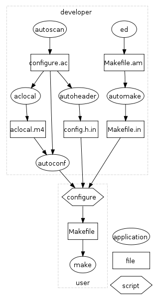

<p align="center"></p>

<p align="center"></p>

<p align="center>

[](https://github.com/mayank-02/msort)

[](https://opensource.org/licenses/MIT)

</p>

msort is a command line utility which can :

1. Sort lines of all the named files together and write the result to specified output.
2. Merge lines of all presorted files together and write the result to specified output.

It uses external sorting mechanism to sort files of **any** size.

## Installation

Follow following steps to install msort in your system

```bash
# Generate Makefile from Makefile.in
> ./configure

# Use Makefile to build the program
> make

# Use Makefile to install the program
> sudo make install
```

You can uninstall msort using

```bash
# Use Makefile to uninstall the program
> sudo make uninstall
```

## Manual Page

Once installed, to check out the manual page for msort, do

```bash
> man msort
```

## Options supported

```
-m
Merge only; the input file shall be assumed to be already sorted.

-o output
Specify the name of an output file to be used instead of the standard output.

-d
Specify that only <blank> characters and alphanumeric characters, shall be
significant in comparisons. The behavior is undefined for a sort key to which
-i or -n also applies.

-f
Consider all uppercase characters that have lowercase equivalents, to be the
lowercase equivalent for the purposes of comparison.

-i
Ignore all characters that are non-printable.

-n
Restrict the sort key to an initial numeric string, consisting of optional
<blank> characters, optional <hyphen-minus> character, and zero or more digits
with an optional radix character, which shall be sorted by arithmetic value.
An empty digit string shall be treated as zero. Leading zeros and signs on
zeros shall not affect ordering.

-r
Reverse the sense of comparisons.

-b
Ignore leading <blank> characters.

-t  char
Use char as the field separator character. Each occurrence of char shall be
significant (for example, <char><char> delimits an empty field). If -t is not
specified, <blank> character shall be used as default field separators.

-k  field_start[,field_end]
The keydef argument is a restricted to field_start and field_end which define a
key field restricted to a portion of the line. If no -k option is specified,
a default sort key of the entire line shall be used.

Note : All byte sequences conform to POSIX locale.
```

Operands :

```
file
A pathname of a file(text files only) to be sorted or merged. If no file operands are specified, the standard input shall be used. If sort encounters an error when opening or reading a file operand, it may exit by writing an error to standard output without processing later operands.
```

## Usage

```
> msort -bdf infile.txt

Sorts infile.txt ignoring leading spaces and case, according to dictionary order and then outputs the result on the screen
```

```
> msort -nru -k2,2 infile.txt -o outfile.txt

Sorts infile.txt according to 2nd column, numerically and in reverse order.
Also, all duplicate lines are supressed. Result is stored in outfile.txt.
```

```
> msort -k4.2,4.8 -t, infile.txt

Sorts infile.txt according contents between 2nd character of 4th <,> separated
field and 8th character of 4th <,> separated field.
```

```
> msort -m infile1.txt infile2.txt

Only merges both the files and outputs to stdout.
```

Note: Use LC_ALL = C before using linux sort to match outputs
```bash
> LC_ALL = C sort -k4.2,4.8 -t, infile.txt
```

## Implementation

To sort user input or files of any size, **external sorting** was implemented. It
was done in 3 stages :

1. Making Runs : Breaking the input into small blocks having size less than size of internal memory using a single buffer.
2. Sorting the Runs : Using quicksort sorting algorithm to sort the contents of the buffer depending on the data type and options. The
buffer was then output to a file stored temporarily on the hard
disk.
3. Merging Sorted Runs : A merge utility was used which uses 2-way merge. Sorted runs created after Step 2 were passed as arguments and the output files at each stage were later again passed to it until only one file remained.

**Handling options :**

+ To handle the various options, data was classified as string or numeric.
+ Options were handled using the getopt() function.
+ Two comparator functions were made, namely strcompare() and numcompare().
+ Each function returned an integer based on which qsort() ordered the strings.
+ The original strings weren't modified at all.
+ Comparisons were made based on key specified (entire line if not). They were
done byte by byte using the collating sequence for POSIX locale (LC_ALL = C)
to avoid ambiguity of results on different machines.

**Undestanding automake:**



On the maintainer’s system:

```bash
# Set up an m4 environment
aclocal

# Generate configure from configure.ac
autoconf

# Generate Makefile.in from Makefile.am
automake --add-missing

# Generate Makefile from Makefile.in
./configure

# Use Makefile to build and test a tarball to distribute
make distcheck
```

On the end-user’s system:

```bash
 # Generate Makefile from Makefile.in
./configure

# Use Makefile to build the program
make

# Use Makefile to install the program
sudo make install
```

## References

1. To understand how sort and it's various options work :
   + [GNU sort](https://www.gnu.org/software/coreutils/manual/html_node/sort-invocation.html)
   + [Open Group Base Specifications sort](http://pubs.opengroup.org/onlinepubs/9699919799/utilities/sort.html)
   + [Man page](http://man7.org/linux/man-pages/man1/sort.1.html)
   + ['sort' command - 2 minute tutorial](http://2min2code.com/articles/sort_command_intro/)
   + [Linux sort command](https://www.computerhope.com/unix/usort.htm)

2. Understanding External Sorting :
   + [External Sorting](https://cis.stvincent.edu/html/tutorials/swd/extsort/extsort.html)
   + [CS302 --- External Sorting](http://web.eecs.utk.edu/~leparker/Courses/CS302-Fall06/Notes/external-sorting2.html)

3. [How locale affects sort?](http://pubs.opengroup.org/onlinepubs/9699919799/nframe.html)

4. [Using getopt() function](https://www.cs.rutgers.edu/~pxk/416/notes/c-tutorials/getopt.html)

5. [Miscellaneous help](https://stackoverflow.com/)

6. [Automake](http://mij.oltrelinux.com/devel/autoconf-automake/)

7. Books :
   + The C Programming Language by Kernighan and Ritchie :
   Referred to sorting algorithms like quicksort and also on how to write comparator functions for qsort().
   + Fundamentals of Data Structures by Ellis Horowitz and Sartaj Sahni : Referred for external sorting and various sorting algorithms.

## Authors

[Mayank Jain](https://github.com/mayank-02)

## Contributing

Pull requests are welcome. For major changes, please open an issue first to discuss what you would like to change.

Please make sure to update tests as appropriate.

To test msort, you can run the tests as follows

```bash
# Make sure msort has been installed first
cd tests/
./tests.sh
```

## License

[MIT](https://choosealicense.com/licenses/mit/)